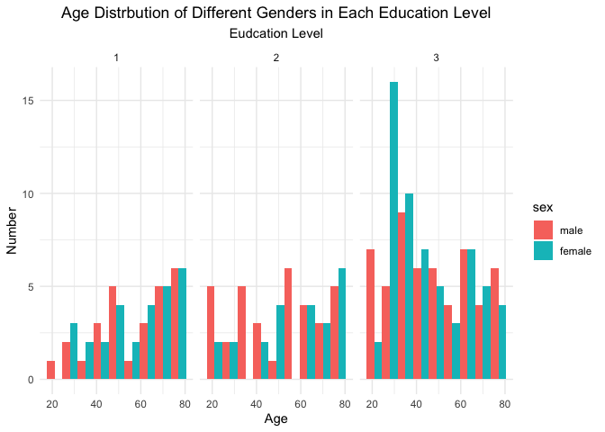
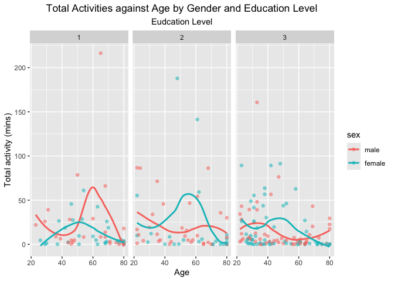
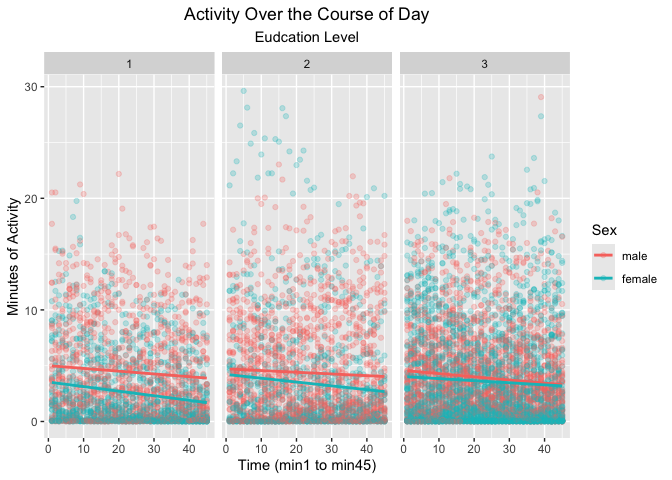

p8105_hw3_yc4585
================
2024-10-14

``` r
library(readr)
library(dplyr)
library(tidyr)
library(ggplot2)
```

# Problem 2

### load and clean data

``` r
accel_df=read_csv("./hw3_data/nhanes_accel.csv") |>
  janitor::clean_names()
demo_df=read_csv("./hw3_data/nhanes_covar.csv",skip = 4) |>
  janitor::clean_names() |>
  na.omit()
combined_ac_df=left_join(demo_df,accel_df,by="seqn") |>
  filter(age>21) |>
  mutate(
    sex = factor(
      sex, levels = c(1, 2), 
      labels = c("male", "female"))) 
```

### table of gender and education

``` r
gender_edu_table=
combined_ac_df |>
  group_by(sex) |>
  summarise(education_level=education) |>
  count(sex,education_level) |>
  pivot_wider(
    names_from = education_level,
    values_from = n
  ) |>
  rename(
    education_level_1="1",
    education_level_2="2",
    education_level_3="3"
  )
```

``` r
print(gender_edu_table)
```

    ## # A tibble: 2 × 4
    ## # Groups:   sex [2]
    ##   sex    education_level_1 education_level_2 education_level_3
    ##   <fct>              <int>             <int>             <int>
    ## 1 male                  27                34                54
    ## 2 female                28                23                59

### plot of age distribution of different gender in each education level

``` r
age_dist_plot=
combined_ac_df |>
  group_by(sex,age) |>
  summarise(education_level=education) |>
  ggplot(aes(x=age,fill=sex)) +
  geom_histogram(position = "dodge", binwidth = 7) +
  facet_grid(. ~ education_level) +
  labs(title = 'Age Distrbution of Different Genders in Each Education Level',
       subtitle = 'Eudcation Level',
       x = 'Age',
       y = 'Number',
       fill = 'sex') +
  theme(plot.title = element_text(hjust = 0.5),  
        plot.subtitle = element_text(hjust = 0.5))
```

    ## `summarise()` has grouped output by 'sex', 'age'. You can override using the
    ## `.groups` argument.

``` r
print(age_dist_plot)
```

<!-- -->

For the table, we can see that at education levels 1 and 3, the number
of males and females is about the same, but at education level 2, the
number of males is significantly higher than that of females.

As for the plot, overall, the number of people at education level 3 is
the highest, while education level 1 has the lowest number of
individuals. Considering gender, we observe that at education level 1,
among those around 20 years old, men outnumber women. However, as age
increases, the number of women also rises, and in the age group over 70,
the number of men and women is about the same.

At education level 2, in the younger and middle-aged groups, men
generally outnumber women, but in older age groups, women equal or even
surpass men in number. For education level 3, the middle age group has
more women than men, while at ages around 20 and 80, there are more men
than women. \### total activity against age

``` r
total_act_plot=
combined_ac_df |>
  group_by(seqn,age,sex,education) |>
  summarise(sum_mins=sum(min1:min45)) |>
  ggplot(aes(x=age,y=sum_mins,color=sex)) +
  geom_point(alpha=0.5) +
  geom_smooth(se = FALSE) +
  labs(title = 'Total Activities against Age by Gender and Education Level',
       subtitle = 'Eudcation Level',
       x = 'Age',
       y = 'Total activity (mins)',
       fill = 'sex') +
  facet_grid(. ~ education)+
  theme(plot.title = element_text(hjust = 0.5),  
        plot.subtitle = element_text(hjust = 0.5))
```

    ## `summarise()` has grouped output by 'seqn', 'age', 'sex'. You can override
    ## using the `.groups` argument.

``` r
print(total_act_plot)
```

    ## `geom_smooth()` using method = 'loess' and formula = 'y ~ x'

<!-- -->

Across all three education levels, middle-aged women have a higher total
level of activity compared to their younger and older age groups. In
education level 1, men around 60 years old show a peak in total
activities.

For both education levels 2 and 3, middle-aged women engage in more
total activities than men. However, in the age group over 70 years old,
men in both groups have more total activities than women. \### plot of
24-hour activity

``` r
act_24_plot=
combined_ac_df |>
  pivot_longer(
      min1:min45,
      names_to = "time", 
      values_to = "mins") |>
  mutate(time = as.numeric(gsub("min", "", time))) |>
  ggplot(aes(x=time,y=mins,color=sex))+
  geom_point(alpha=0.25) +
  geom_smooth(method=lm,se = FALSE) +
  facet_grid(. ~ education) +
  labs(title = "Activity Over the Course of Day",
      subtitle = 'Eudcation Level',
       x = "Time (min1 to min45)",
       y = "Minutes of Activity",
       color = "Sex") +
  theme(plot.title = element_text(hjust = 0.5),  
        plot.subtitle = element_text(hjust = 0.5))

print(act_24_plot)
```

    ## `geom_smooth()` using formula = 'y ~ x'

<!-- -->

In the plot, we used a linear model for fitting the data. For the three
different education levels across both sexes, it is evident that
activity time decreases over time. Additionally, for all three education
levels, males demonstrate more activity time than females; however, as
education level increases, the gap between the two narrows.
