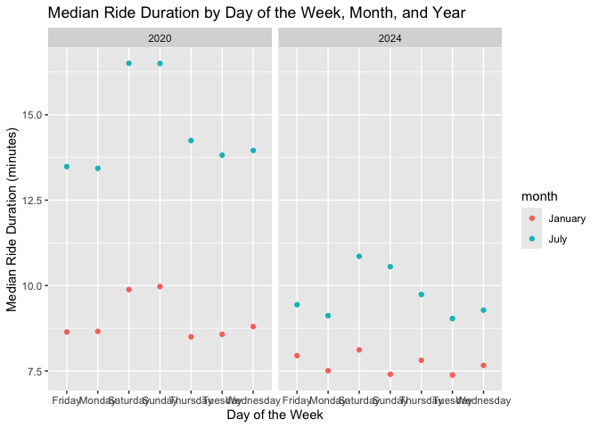
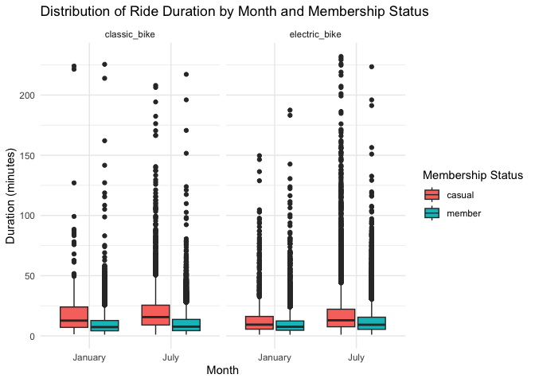

p8105_hw3_yc4585
================
2024-10-14

``` r
library(readr)
library(dplyr)
library(tidyr)
library(ggplot2)
```

# Problem 2

### load and clean data

``` r
accel_df=read_csv("./hw3_data/nhanes_accel.csv") |>
  janitor::clean_names()
demo_df=read_csv("./hw3_data/nhanes_covar.csv",skip = 4) |>
  janitor::clean_names() |>
  na.omit()
combined_ac_df=left_join(demo_df,accel_df,by="seqn") |>
  filter(age>21) |>
  mutate(
    sex = factor(
      sex, levels = c(1, 2), 
      labels = c("male", "female"))) 
```

### table of gender and education

``` r
gender_edu_table=
combined_ac_df |>
  group_by(sex) |>
  summarise(education_level=education) |>
  count(sex,education_level) |>
  pivot_wider(
    names_from = education_level,
    values_from = n
  ) |>
  rename(
    education_level_1="1",
    education_level_2="2",
    education_level_3="3"
  )
```

``` r
print(gender_edu_table)
```

    ## # A tibble: 2 × 4
    ## # Groups:   sex [2]
    ##   sex    education_level_1 education_level_2 education_level_3
    ##   <fct>              <int>             <int>             <int>
    ## 1 male                  27                34                54
    ## 2 female                28                23                59

### plot of age distribution of different gender in each education level

``` r
age_dist_plot=
combined_ac_df |>
  group_by(sex,age) |>
  summarise(education_level=education) |>
  ggplot(aes(x=age,fill=sex)) +
  geom_histogram(position = "dodge", binwidth = 7) +
  facet_grid(. ~ education_level) +
  labs(title = 'Age Distrbution of Different Genders in Each Education Level',
       subtitle = 'Eudcation Level',
       x = 'Age',
       y = 'Number',
       fill = 'sex') +
  theme(plot.title = element_text(hjust = 0.5),  
        plot.subtitle = element_text(hjust = 0.5))
```

    ## `summarise()` has grouped output by 'sex', 'age'. You can override using the
    ## `.groups` argument.

``` r
print(age_dist_plot)
```

<!-- -->

For the table, we can see that at education levels 1 and 3, the number
of males and females is about the same, but at education level 2, the
number of males is significantly higher than that of females.

As for the plot, overall, the number of people at education level 3 is
the highest, while education level 1 has the lowest number of
individuals. Considering gender, we observe that at education level 1,
among those around 20 years old, men outnumber women. However, as age
increases, the number of women also rises, and in the age group over 70,
the number of men and women is about the same.

At education level 2, in the younger and middle-aged groups, men
generally outnumber women, but in older age groups, women equal or even
surpass men in number. For education level 3, the middle age group has
more women than men, while at ages around 20 and 80, there are more men
than women. \### total activity against age

``` r
total_act_plot=
combined_ac_df |>
  group_by(seqn,age,sex,education) |>
  summarise(sum_mins=sum(min1:min45)) |>
  ggplot(aes(x=age,y=sum_mins,color=sex)) +
  geom_point(alpha=0.5) +
  geom_smooth(se = FALSE) +
  labs(title = 'Total Activities against Age by Gender and Education Level',
       subtitle = 'Eudcation Level',
       x = 'Age',
       y = 'Total activity (mins)',
       fill = 'sex') +
  facet_grid(. ~ education)+
  theme(plot.title = element_text(hjust = 0.5),  
        plot.subtitle = element_text(hjust = 0.5))
```

    ## `summarise()` has grouped output by 'seqn', 'age', 'sex'. You can override
    ## using the `.groups` argument.

``` r
print(total_act_plot)
```

    ## `geom_smooth()` using method = 'loess' and formula = 'y ~ x'

<!-- -->

Across all three education levels, middle-aged women have a higher total
level of activity compared to their younger and older age groups. In
education level 1, men around 60 years old show a peak in total
activities.

For both education levels 2 and 3, middle-aged women engage in more
total activities than men. However, in the age group over 70 years old,
men in both groups have more total activities than women. \### plot of
24-hour activity

``` r
act_24_plot=
combined_ac_df |>
  pivot_longer(
      min1:min45,
      names_to = "time", 
      values_to = "mins") |>
  mutate(time = as.numeric(gsub("min", "", time))) |>
  ggplot(aes(x=time,y=mins,color=sex))+
  geom_point(alpha=0.25) +
  geom_smooth(method=lm,se = FALSE) +
  facet_grid(. ~ education) +
  labs(title = "Activity Over the Course of Day",
      subtitle = 'Eudcation Level',
       x = "Time (min1 to min45)",
       y = "Minutes of Activity",
       color = "Sex") +
  theme(plot.title = element_text(hjust = 0.5),  
        plot.subtitle = element_text(hjust = 0.5))

print(act_24_plot)
```

    ## `geom_smooth()` using formula = 'y ~ x'

<!-- -->

In the plot, we used a linear model for fitting the data. For the three
different education levels across both sexes, it is evident that
activity time decreases over time. Additionally, for all three education
levels, males demonstrate more activity time than females; however, as
education level increases, the gap between the two narrows.

# Problem 3

### import and clean data

``` r
Jan_2020=read_csv("./hw3_data/citibike/Jan 2020 Citi.csv") |>
  janitor::clean_names() |>
  mutate(year=2020,month="January")


Jan_2024=read_csv("./hw3_data/citibike/Jan 2024 Citi.csv") |>
  janitor::clean_names() |>
  mutate(year=2024,month="January")


July_2020=read_csv("./hw3_data/citibike/July 2020 Citi.csv") |>
  janitor::clean_names() |>
  mutate(year=2020,month="July")

July_2024=read_csv("./hw3_data/citibike/July 2024 Citi.csv") |>
  janitor::clean_names() |>
  mutate(year=2024,month="July")

combined_bike_df <- bind_rows(Jan_2020, July_2020,Jan_2024,July_2024)
```

In the combined_bike_df dataset, we have information about the year,
month, and weekday when each ride took place, the user ID, membership
status, and the type of bike chosen. Additionally, the dataset provides
details about the trip, including the start and end stations as well as
the duration. \### ride number by membership status

``` r
table_ride_number=
combined_bike_df |>
  group_by(year,month) |>
  count(member_casual) |>
  pivot_wider(
    names_from = member_casual,
    values_from = n
  ) |>
  knitr::kable()

print(table_ride_number)
```

    ## 
    ## 
    ## | year|month   | casual| member|
    ## |----:|:-------|------:|------:|
    ## | 2020|January |    984|  11436|
    ## | 2020|July    |   5637|  15411|
    ## | 2024|January |   2108|  16753|
    ## | 2024|July    |  10894|  36262|

From the table, we can see that the number of Citi Bike members has been
increasing. For casual riders, there was a decline from July 2020 to
January 2024, but the number increased from January 2024 to July 2024.
The most rapid growth for both casual riders and Citi Bike members
occurred from January 2024 to July 2024, with casual riders increasing
by nearly five times and Citi Bike members increasing by more than
twice. Additionally, there are consistently more Citi Bike members than
casual riders.

### table of 5 most popular starting station for 7,2024

``` r
popular_5_df=
July_2024 |>
  group_by(start_station_name) |>
  count(start_station_name) |>
  arrange(desc(n)) |> 
  rename(number_rides_origin=n) |>
  head(5) |>
  knitr::kable()

print(popular_5_df)
```

    ## 
    ## 
    ## |start_station_name       | number_rides_origin|
    ## |:------------------------|-------------------:|
    ## |Pier 61 at Chelsea Piers |                 163|
    ## |University Pl & E 14 St  |                 155|
    ## |W 21 St & 6 Ave          |                 152|
    ## |West St & Chambers St    |                 150|
    ## |W 31 St & 7 Ave          |                 146|

### plot of different effections on duration

``` r
median_duration_plot=
  combined_bike_df |>
  group_by(year,month,weekdays) |>
  summarise(median_duration=median(duration,na.rm=TRUE)) |>
  ggplot(aes(x=weekdays,y=median_duration,color=month)) +
  geom_point() +
  facet_wrap(~ year) +
  labs(title = "Median Ride Duration by Day of the Week, Month, and Year",
       x = "Day of the Week",
       y = "Median Ride Duration (minutes)",
       fill = "Month") 
```

    ## `summarise()` has grouped output by 'year', 'month'. You can override using the
    ## `.groups` argument.

``` r
print(median_duration_plot)
```

<!-- --> From the
plot, we can see that in both 2020 and 2024, the median ride duration is
always longer in July than in January, likely due to the cold weather in
January. Additionally, the gap in median ride duration between January
and July is larger in 2020 than in 2024. We can also observe that in
2020, the duration in both July and January is higher than that in
January and July of 2024.

Regarding weekdays, in 2020, both January and July show that Saturday
and Sunday have significantly longer durations compared to other days of
the week. In 2024, during July, Saturday and Sunday have longer
durations than the other days; however, in January, Friday and Saturday
have the highest durations, while Monday, Sunday, and Tuesday are
similar. \### impact on the distribution of ride duration

``` r
distribution_duration_plot =
  bind_rows(Jan_2024,July_2024) |>
  ggplot(aes(x = month, y = duration, fill = member_casual)) +
  geom_boxplot() +
  labs(title = 'Distribution of Ride Duration by Month and Membership Status',
       x = 'Month',
       y = 'Duration (minutes)',
       fill = 'Membership Status') +
  theme_minimal() +
  facet_wrap(~ rideable_type) 

print(distribution_duration_plot)
```

<!-- -->

This plot shows the distribution of ride duration across different
months and membership status, with classic bike rides on the left and
electric bike rides on the right. The distribution is displayed using
boxplots. We can observe that, generally, casual riders have longer ride
durations than Citi Bike members. Overall, ride durations in July tend
to be longer than those in January. Regarding bike type, classic bikes
have a longer overall ride duration, but electric bikes show more
long-duration outliers.
